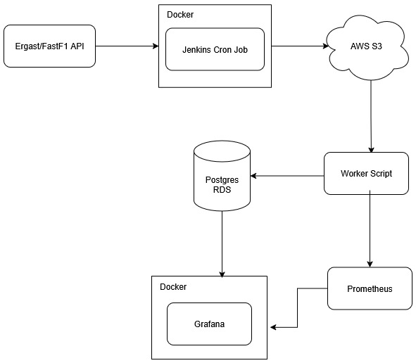

# F1 Telemetry Aggregator

---

**Goal:** build a small backend service that ingests F1 race/telemetry data, processes and stores aggregated metrics, exposes a simple API, and demonstrates shipping + operating practices (CI/CD, infra-as-code, monitoring, SLOs, incident handling). Minimal front-end using Grafana to display data.

## High-level architecture (ASCII)

## Components summary

* **Ingest job** — Cron job with Jenkins that fetches Ergast and scrapes race telemetry from Fast F1 then writes raw JSON to S3
* **Processing service** — Worker script that normalizes and aggregates raw data and writes to Postgres (and optionally emits snapshots to S3).
* **Storage** — Postgres RDS for relational queries; S3 for raw/archival data.
* **CI/CD** — Jenkins builds, runs tests, pushes to S3, then runs batch script before pushing to Postgres RDS.
* **Infra as Code** — CloudFormation describes RDS and IAM roles.
* **Monitoring** — Prometheus scrapes /metrics endpoints on services; Grafana shows dashboards; Alertmanager sends alerts.

## Considerations
### Known Bugs
- The batch job stores duplicate raw weather data in the S3 bucket every time it runs.

### Scaling
Using a program like Kubernetes or running multiple containers on Docker could be used to horizontally scale the aggregator. In the event that I needed to scale for more users, I would use this technique in combination with a load balancer.

### Opportunities for Improvement
The purpose of this project was to practice setting up CI/CD pipelines, use Docker and practice proper testing and deployment techniques. 

## Other Docs

See below for documentation regarding specific parts of the project.

- [Ingest Documentation](docs/ingest.md)
- [Batch Script Documentation](docs/batch.md)
