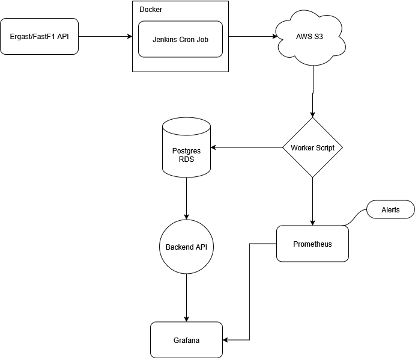

# F1 Telemetry Aggregator

---

**Goal:** build a small backend service that ingests F1 race/telemetry data, processes and stores aggregated metrics, exposes a simple API, and demonstrates shipping + operating practices (CI/CD, infra-as-code, monitoring, SLOs, incident handling). Minimal front-end using Grafana to display data.

## High-level architecture (ASCII)

## Components summary

* **Ingest job** — Cron job with Jenkins that fetches Ergast and scrapes race telemetry from Fast F1 then writes raw JSON to S3
* **Processing service** — Dockerized worker that normalizes and aggregates raw data and writes to Postgres (and optionally emits snapshots to S3).
* **API service** — Dockerized FastAPI app exposing endpoints for aggregated stats.
* **Storage** — Postgres RDS for relational queries; S3 for raw/archival data.
* **CI/CD** — Jenkins builds, runs tests, pushes to ECR, then deploys CloudFormation.
* **Infra as Code** — CloudFormation (or Terraform) describes ECR, ECS Cluster/TaskDefinition, ALB, RDS, IAM roles, and Prometheus/Grafana hosting.
* **Monitoring** — Prometheus scrapes /metrics endpoints on services; Grafana shows dashboards; Alertmanager sends alerts.

## Getting Started

## Other Docs

See below for documentation regarding specific parts of the project.

- [Ingest Documentation](docs/ingest.md)
- [Batch Script Documentation](docs/batch.md)
- [API Documentation](docs/api.md)